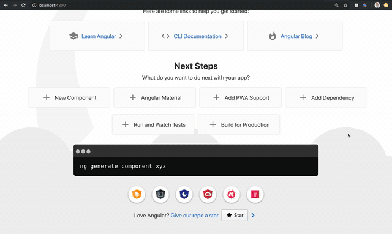
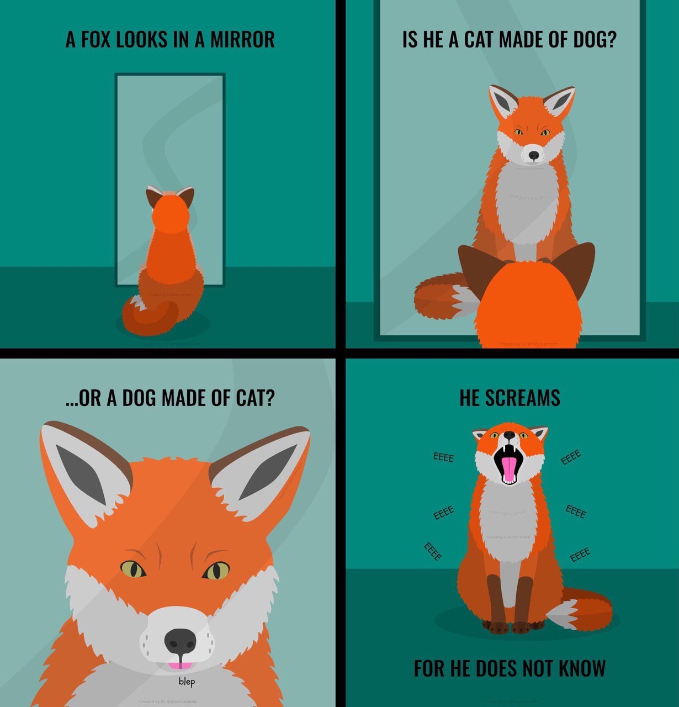

# ✨🦊 Angular Platform Cloud 🦄✨

  

✨🦊 **The server** generates renderer commands and sends them to the browser.

✨🦄 **The browser** processes the DOM events and sends them to the server.

Perhaps am thinking about goals like this:
- lightweight browser bundle (maybe) 
- remote development when the front-end is running on the server
- security frontend when the client does not see the code
- one more example of the Angular Platform
- <<< YOUR GOALS HERE >>>

## Help Wanted

I invite everyone to participate in the development of ✨🦊 **Angular Platform Cloud** 🦄✨. To participate, just stamp the blood [Twitter](https://twitter.com/thekiba_io) or [Telegram](https://t.me/thekiba).

## Roadmap

 | Feature                | Server Side        | Browser Side             | 
 | ---------------------- | ------------------ | ------------------------ |
 | JIT support            |  ✅                | ✅                       |
 | AOT support            |  ⭕ not yet        | ✅                       |
 | Angular Builder        |  ⭕ not yet        | ⭕ not yet               |
 | Serializer             |  ✅                | ✅                       |
 | Object Store           |  ✅                | ✅                       |
 | Rendering              |  ✅                | ✅                       |
 | Event Manager          |  ✅                | ✅                       |
 | Location               |  ✅                | ✅                       |
 | Viewport Scroller      |  ⭕ not yet        | ⭕ not yet               |
 | Styles Host            |  ✅                | ✅                       |
 | Error Handler          |  ✅                | ✅                       |
 | Custom Transport       |  ⭕ not yet        | ⭕ not yet               |
 
 
## Development server

Run `npm run serve:dev` for a dev server. Navigate to `http://localhost:4200/`. The app will automatically reload if you change any of the source files.

  

